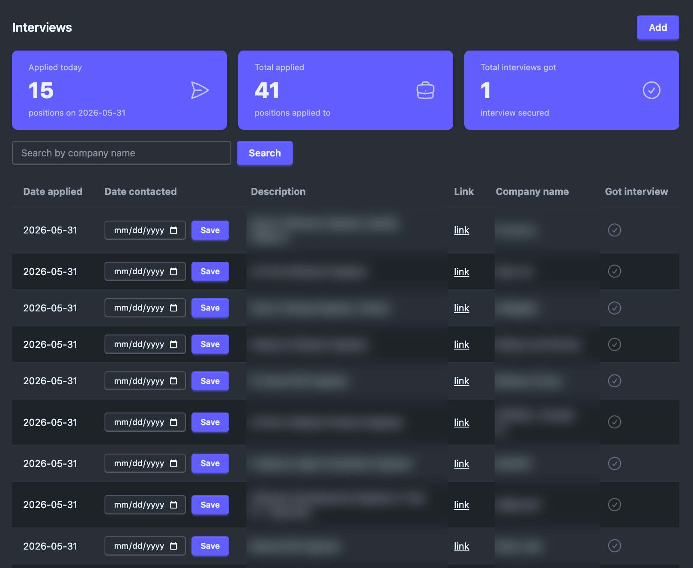

# InterviewManagement

A small Phoenix (Elixir) app to manage the job interviews you've applied to,
track each company, the date you applied, the date they contacted you, the
description, and the link from the application. Some charts for you have better statistics are coming soon.

## Getting started

* Run `mix setup` to install dependencies and set up the database
* Start the server with `mix phx.server` (or `iex -S mix phx.server`)
* Visit [`localhost:4000`](http://localhost:4000)
